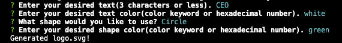

# SVG Logo Generator 

## Table of Contents
* [Description](#description)
* [Installation](#installation)
* [Usage](#usage)
* [License](#license)
* [Contributors](#contributors)
* [Tests](#tests)
* [Questions](#questions)

## Description
This application will allow you to dynamically generate a 300x200px logo and save it as an SVG file. It will prompt the user via command line prompts to select a color and shape along with entering their desired text. 
## Installation
To install this application, create a directory in which you will develop your application. Inititalize a `package.json` file by running `npm init -y`. You can then set up your git repo by running `git init` and creating a `.gitignore` file. You will include `node_modules` and `.DS_store` in your `.gitignore` to ensure they are not tracked or uploaded to GitHub. Ensure that your `package.json` file contains all of the required dependencies, including `inquirer: ^8.2.4` and `jest ^24.9.0` along with `"test": "jest"` in the scripts section. After checking your dependencies, install inquirer and jest by running `npm install` in your root directory. You should see your `node_modules` folder populate in your root directory.
## Usage
To use this application, make sure you have followed all installation instructions and installed `inquirer: ^8.2.4` and `jest: ^24.9.0`. Verify that your main JS file is listed under "main" in your `package.json` file. Navigate to the directory containing your main JS file and run it using the command `node (filename).js`. Answer the generated prompts and enter your desired text. Once all prompts have been answered, your file will automatically be generated in your directory. You can then publish this file to your remote GitHub repository or export it for use in another project. 
#### Example of command line prompts for this application.

#### Video recording of program flow and output. 

## License
ISC License

https://opensource.org/licenses/ISC
## Contributors
This application currently has no contributors other then myself, Chase Ostien.
## Tests
Tests for this application are setup using jest and are designed to match the expected SVG file code with the generated SVG file code. To run the tests, run `npm run test` in your root directory. If you have installed jest correctly, this will run all tests. You can also test the function of the application by initiaiting it and asnwering the prompts to generate a file. Once you have generated a file and have viewed the output, you can iterate on this in future generated files.
## Credits
This README file was created using a command line README generator developed by myself and hosted at the GitHub repo below.

https://github.com/ChaseOstien/README_Generator

## Questions
### If you have any questions about this application, please send all correspondence to the contact info listed below. 
* GitHub: ChaseOstien - https://github.com/ChaseOstien
* Email: Chaseostien@gmail.com